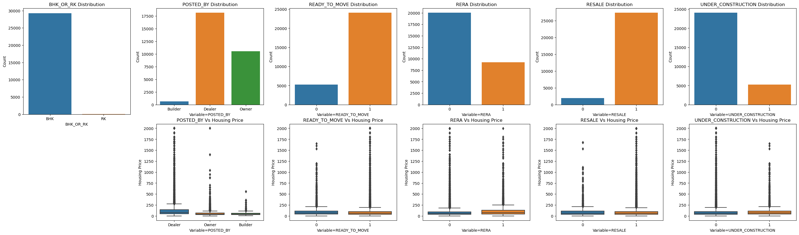
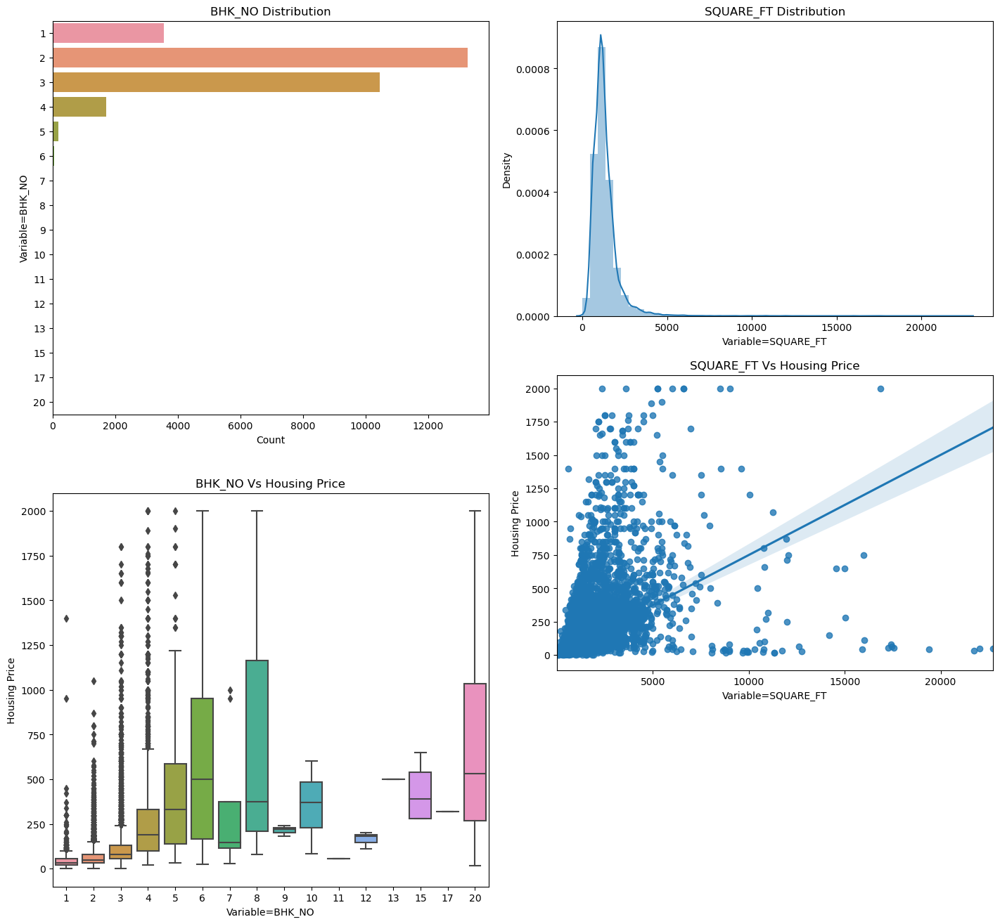
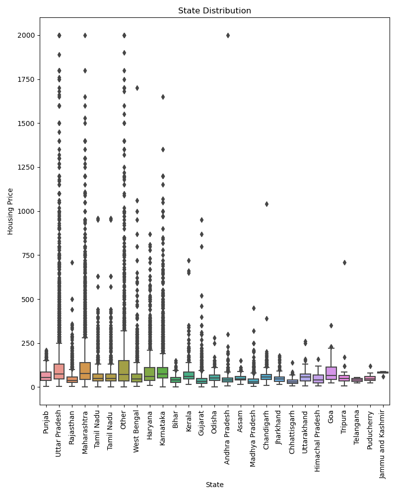
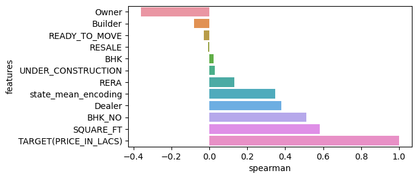
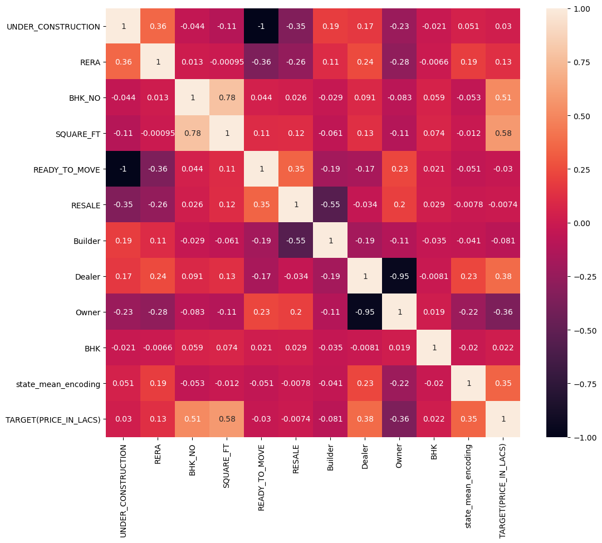
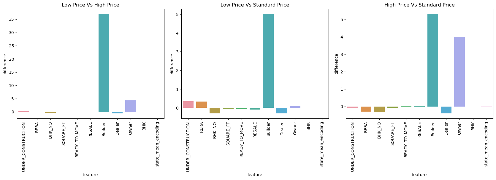
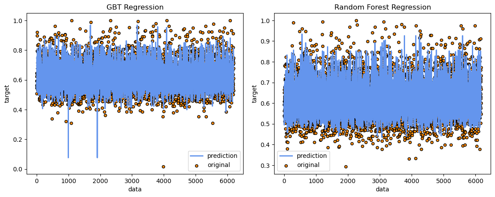

# SOEN6111-BIG-DATA project proposal
## ABSTRACT
   The model established in this project mainly discusses the housing price issue in India.
   
   The data for this project comes from Kaggle, in which data from recent years is selected for this project. The data set provides 12 influencing factors. Therefore, when predicting the current Indian housing prices, this project should also consider the impact on Indian housing prices from the aspects of address, square, longitude, under construction, resale or not, etc. The primary project process is data processing, visual analysis and modeling prediction.

## INTRODUCTION
### Context
  Buyers not only care about the size of the house (square feet), but various other factors play a key role in determining the price of the house/property. Finding the correct set of attributes to help understand buyer behavior can be very difficult. The data set has collected data from various real estate dealers in India. The data set provides 11 influencing factors and accurately predicts house prices through modeling.
  
### Objectives
  In real life, we often encounter the problem of classification and prediction. The target variable value is usually affected by multiple factors, and different factors have different effects on the target variable, so the weight will be different. Some factors are high, and some factors have a small weight. We usually use known factors to predict the value of the target variable.
  
  House prices are affected by many factors, such as address, area, and availability of immediate check-in. So we use big data analysis to get the trend of housing prices and the main factors affecting housing prices, and then we can be more familiar with the needs of buyers and the Indian housing market.

### The Problem to Solve
  1.What factors influence the price of houses?
  
  2.Dividing housing price data into three price levels(high-medium-low)，studing the impact of influencing factors on housing prices at different levels.
  
  3.The prediction of housing price in India in the future.
   
### Related Work
  The research on housing price forecasting in recent years found that dealing with housing price forecasting problems generally starts from the analysis of the influencing factors of housing price. Housing price analysis has a long history. Bensen used multiple regression method to predict housing price in 1997, and Malpezzi in 1999 Using time series cross-section regression to analyze housing prices, Song used GIS to extract influencing factors and then constructed a characteristic price model to analyze housing prices. The current trend is also the method of this project as follows:
  
  The general process is to first check whether the data is missing. If there is a missing value, the missing value must be processed first.Since there are many influencing factors, visual analysis will be carried out next. First, by calculating the correlation of the variables, properly draw the normal probability diagram, the distribution diagram of each quantitative variable, calculate the skewness of the quantitative data, and then perform quantitative feature analysis, specifically including analysis of variance or analysis of variance, and then perform related calculations. Since house prices are divided into three levels: high-medium-low, price breakdowns are needed.

## MATERIALS AND METHODS
### The Dataset
The open dataset we utilized is from Kaggle, and the download page is linked below: https://www.kaggle.com/ishandutta/machine-hack-housing-price-prediction

This dataset has been collected across various property aggregators across India. The dataset is contained with 29451 rows and 12 columns, providing 12 influencing factors of the housing price, including three categorical features, four boolean features, and five quantitative features.

   Variable Name             | Type   
   --------                  | :-----------:
   POST_BY                   | Categorical 
   UNDER_CONSTRUCTION        | Boolean 
   RERA                      | Boolean 
   BHK_NO.                   | Real number 
   BHK_OR_RK                 | Categorical
   SQUARE_FT                 | Real number
   READY_TO_MOVE             | Boolean
   RESALE                    | Boolean
   ADDRESS                   | Categorical
   LONGITUDE                 | Real number
   LATITUDE                  | Real number
   TARGET(PRICE_IN_LACS)     | Real number

   Table 1. description of the dataset

 

### Technologies and Algorithms
Aiming to research the problems we proposed above, this project is separated into four components, which are 1)data exploration, 2)data pre-processing, 3)data analysis, 4) training two different regression models and investigating differences between them.

#### A.Data Explore
The first step is starting with data exploration. We loaded the dataset as a Spark dataframe and took a quick inspection of the description of the dataset. There are no missing values in all 12 features, and one categorical feature "ADDRESS" has high cardinality, which needs to be re-categorized in the pre-processing step. Visualization of all categorical features is presented by plotting histograms illustrating the distribution of each feature and boxplots in Figure 1.  Quantitative features are represented by plotting data and a linear regression model to fit it with the import of seaborn library[1] in Figure 2.

   Figure 1. categorical features

   Figure 2. quantitative features

#### B.Data Pre-processing 
Below are a few feature engineering processes which were done: cleaning, re-categorization, log transformation, normalization, and encoding on the dataset.

1) The feature "SQUARE_FT" has few univariate data exceeding  30000.0ft which skews an existing statistical relationship[2]. Through Inter-Quartile Range (IQR), an outlier x can be detected if: 
x < Q1 − 1.5 · IQR OR Q3 + 1.5 · IQR < x (1) 
where: Q1 = 25th percentiles  Q3 = 75th percentiles   IQR = Q3 − Q1 
After applying Equation (1) to every column of the dataset, the final dataset contains 29272 rows.

2) Add the feature "state" indicating the address of the house belonging to which state by re-categorizing the feature "ADDRESS." An additional dataset[3] of  529,156 cities in India, including a city's latitude, longitude, and state was joined with our train dataset to generate the corresponding state for each address. Noticeable differences in housing prices across 27 states are visualized in Figure 3.

   Figure 3. the state feature

3) Log transformation transforms highly skewed variables("BHK_NO","SQUARE_FT","TARGET_PRICE") into a more normalized dataset by replacing each variable x with a log(x). This allows the quantitative features to follow the normal distribution to improve the fit of the regression models.

4) Normalization is applied to our dataset through the scikit-learn function MinMaxValue[4], scaling each quantitative variable separately into the range [0,1].

5) One-hot encoding and target encoding are adopted to different categorical features. Categorical features with low diversity("POSTED_BY," "BHK_RK") encoded with one-hot encoding. In contrast, highly dispersed categorical variable(the feature "state" has 27 categories) encoded with a target mean encoding by replacing it with the mean of the target variable. Although one-hot encoding is capable of encoding categorical variables with high cardinality,  it induces undesirable sparsity into the dataset, which worsens tree-based ensembles performance[5].

After feature engineering, the final dataset contains 29272 rows with 13 features.

#### C.Data Analysis
Exploratory data analysis is an essential step before building a regression model. In this way, researchers can discover the implicit patterns of the data, which in turn helps choose appropriate machine learning approaches[6].

For solving the first problem, Spearman's correlation and Pearson's correlation between housing price and other variables are measured to inspect the impact of each variable on housing price. 

We divided housing prices into three segments for solving the second problem: low price, standard price, and high price. The measurement of differences in each quantitative feature of three price groups allows us to analyze if the correlations shift with the change of housing price. The results of data analysis are demonstrated by heatmap, histograms with the utilization of seaborn library in the result section.
 

#### D.Modeling Training and Evaluation
Solving the third problem shows that the regression model in machine learning is an appropriate approach to forecast the housing price in our project. We chose random forest regression and gradient-boosted tree regression as our training models. Then the dataset was randomly split data into training and testing sets with a ratio of 4:1 by utilizing the scikit-learn package.

##### Random Forest Regression
Random Forest is one of the tree-based ensemble models that combines the prediction of multiple deep independent trees to create a more accurate final forecast. Previous studies[7] verified that Random Forest is a powerful tool. 
In our project, we used the RandomForestRegression class provided by pyspark. The RandomForestRegression has a "numTrees" parameter indicating how many trees to build, which we set at 100. 

##### Gradient-boosted Regression			
Gradient boosted Regression builds an ensemble of shallow and weak successive trees with each tree learning and improving on the previous. Gradient boosted Regression as a leading method for winning Kaggle competitions has generated a significant impact and has been widely recognized in many domains[8].
In our project, we utilized the GradientBoostedRegressor from pyspark. After tweaking the GradientBoostedRegressor model multiple times, we set the parameter "maxIter" at 100.

We implemented a pipeline for each regression model consisting of a vector assembler and a regression model tuned by model selection via 5-fold cross-validation and a hyperparameter search of parameter "maxDepth'' from a range[8,10,12,15]. Then, we compared all these models, selected the best one, trained it on the training set, and then evaluated it on the test set[9].

Trained models are evaluated on testing sets measured on R2, RMSE and MSE indicators, and the result of evaluations is recorded and analyzed. A comparison on model performances between random forest regression and gradient-boosted Regression is made in the following section.

Code is available at https://github.com/loliamserious/SOEN6111-BIG-DATA

## RESULTS
### Problem 1: Influential factors of housing price
The relationship between housing prices and each feature is portrayed in Figure 4 and Figure 5. 

The Spearman correlation between housing price and each feature is presented in Figure 4. It shows that "square ft" is the main criterion in establishing house price, and "bedroom numbers," "seller category," and "state" have a considerable influence on housing price. In comparison, a correlation between "resale" and housing prices is very close to zero, and so they are excluded from our estimation.

   Figure 4. spearman correlation

The Pearson correlation between housing price and each feature is presented in Figure 5. Feature "square ft" has the most significant correlation with housing prices which is 0.58, followed by "bedroom numbers," "posted by dealer," "posted by owner" and "state," which are 0.51, 0.38, -0.36 and 0.35, respectively. In comparison, correlations between features "resale," "under construction," and housing prices are both under 0.05. There are many strong correlations between variables. Ready to move is strongly correlated with under construction. "Posted by dealer" is negatively correlated with "posted by owner."

   Figure 5. pearson correlation heatmap

All the figures exhibit a similar result presenting the relationship between the features and the housing prices. We could infer that "square ft," "bedroom number," "posted by dealer," "posted by owner" and "state" are influential factors of housing prices in India.

### Problem 2: Driven variables of different price groups
The relationship between selected features and housing prices in three other price groups(low, standard, and high) is portrayed in Figure 6.

   Figure 6. price groups comparison

All the figures illustrate the difference of means of quantitative variables between each two price groups. Figure 6 demonstrates the significant difference of "posted by builder" between each two price groups, which indicates that builders primarily sell houses with low and standard prices. In comparison, most expensive homes are sold by owners, which is derived from the noticeable difference of "posted by owner" between expensive homes and houses with standard prices. In conclusion, the increased importance of the category of house sellers on housing price is demystified.

### Problem 3: Price Forecasting
Many iterations of performance tuning were done to find the optimal solution for each model. Random Forest Regression, Gradient-boosted Regression were intensively tuned grid search provided by pyspark to achieve the results listed in Table 2.

|           Model             |R2 train|R2 test |  RMSE   |  MSE   |Best maxDepth|
|-----------------------------|:------:|:------:|:-------:|:------:| -----------:|
|Random forest regression     |0.609558|0.642973|0.0541915|0.002936|           15|
|Gradient-boosted regression  |0.642398|0.627465|0.0558822|0.003122|            8|

   Table 2. results of regression models

Table 2 presents the estimations of R2 for the train set and test set under Random Forest and Gradient Boosting algorithms, together with the performance metrics: MSE, RMSE, and the best value for parameter maxDepth.

Random Forest Regression employed 5 CV and built 100 trees to converge in 17 minutes. The best value for maxDepth in Random Forest Regression is 15. Then, the results are evaluated by the MSE, RMSE and R2 criteria. These values are estimated to be 0.0029, 0.0542 and 64.3%, implying a reasonable good fit.

Gradient-boosted Regression employed 5 CV and took a maximum of 100 epochs to converge in 47 minutes. The best value for maxDepth in Gradient-boosted Regression is 8. Then, evaluation of the same MSE, RMSE and R2 criteria are applied to the model, which is estimated to be 0.0031, 0.0559 and 62.75%, respectively. 

As listed in Table 2, the best results belong to Random Forest Regression for the testing set and Gradient-boosted Regression for the train set. Gradient-boosted Regression worked well on this dataset. However, Gradient-boosted Regression was prone to overfitting, which led to a decent performance on unseen data. Random Forest was not subject to overfitting, and the accuracy of its predictions was better than that of Gradient-boosted Regression.
 
Based on our estimation results, Figure 7 portrays the scatterplot of property prices in test data and the predictions. We can see that most of our predictions closely fit the origin testing data in Random Forest Regression, demonstrating that the model fits our data sufficiently well. Most of the time, Gradient-boosted Regression also fits the data very well (see Figure 7). Surprisingly, the model did not deliver promising results on some extreme values in housing prices in which two dots (whose values are smaller than 0.1 for housing prices) are lying far away from the cluster.

   Figure 7. predictions of regression models

## DISCUSSION
This project mainly investigates three problems of the housing price in India: the influential factors of housing price, the factor with the most importance of housing prices in different price groups, and the prediction of housing price in India.

In the result of data analysis, we concluded that "square ſt," "seller category," "bedroom number," and "state" are the main factors influencing the housing price. The increased importance of "posted by builder" and "posted by owner" among different price groups inspired us to achieve a more affordable housing price when buying houses from the builder.

Then we compared two different models and analyzed them for optimal solutions for housing price prediction. Even though all of those methods achieved desirable results, different models have their pros and cons. Gradient-boosted Regression method has the highest R2 on the training set, but it is prone to be overfitting, inferred by the evidence that the average R2 of its training set is higher than its testing sets, and the best maxDepth is the smallest value of configured ranges. Random Forest Regression is a decent method when comparing R2 and is not subject to overfitting. Random Forest Regression is slightly better than Gradient-boosted Regression concerning the RMSE and MSE metrics in terms of error minimization, in which RMSE of Random Forest Regression is 15% lower than Gradient-boosted Regression. In terms of time complexity, Random Forest Regression running time is 48% faster than Gradient-boosted Regression since trees are built sequentially in Gradient-boosted Regression.

Although Random Forest slightly outperforms Gradient Boosting in our datasets, this does not imply that Gradient Boosting is necessarily inferior. Hence, it isn't easy to draw a conclusion on the best algorithm for all cases because the model performance tends to be data-specific. What factor should we consider when choosing an algorithm to make predictions on housing prices? We suggest that the choice of algorithm depends on several factors including, the quality of the dataset, computing power, time constraint, and researcher's knowledge about machine learning. If the data set is noisy, Random Forest should be a good choice because it is less sensitive to overfitting than Gradient Boosting. If researchers are experienced in machine learning, we recommend Gradient Boosting because it is a powerful tool for making accurate predictions but challenging to tune.

Finally, we analyzed why the undistinguished R2 score under 0.7 and proposed our assumptions: the correlations between each feature and housing prices are under 0.6, indicating that the original dataset lacks a strong correlation with the housing price.

Further research about the improvement of our project should be conducted further to investigate our topic of housing price in India:
* May leverage Deep Learning methods on feature engineering
* May extend more features to support data analysis and price prediction
* May combine multiple algorithms to increase the accuracy of price prediction
* May investigate the driven factors for the excellent performance of tree-based models[6]
* May exploit and develop real-world applications of our model to facilitate commercial industry and urban development

## REFERENCE
[1]https://seaborn.pydata.org/generated/seaborn.regplot.htm/

[2]https://humansofdata.atlan.com/2018/03/when-delete-outliers-dataset/

[3]https://simplemaps.com/data/in-cities

[4]https://machinelearningmastery.com/standardscaler-and-minmaxscaler-transforms-in-python/

[5]https://towardsdatascience.com/one-hot-encoding-is-making-your-tree-based-ensembles-worse-heres-why-d64b282b5769

[6]Quang Truong, Minh Nguyen, Hy Dang, Bo Mei, Housing Price Prediction via Improved Machine Learning Techniques, Procedia Computer Science, Volume 174, 2020, Pages 433-442, ISSN 1877-0509

[7]BreimanL.RandomForests.SpringerLink.https://doi.org/10.1023/A:1010933404324(accessedSeptember11,2019). 

[8]http://uc-r.github.io/gbm_regression

[9]Winky K.O. Ho, Bo-Sin Tang & Siu Wai Wong (2021) Predicting property prices with machine learning algorithms, Journal of Property Research, 38:1, 48-70, DOI: 10.1080/09599916.2020.1832558

